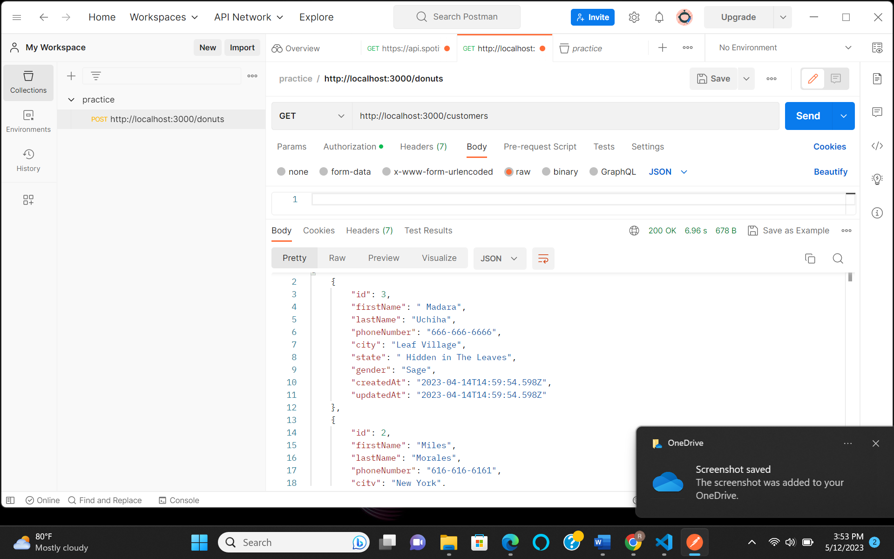
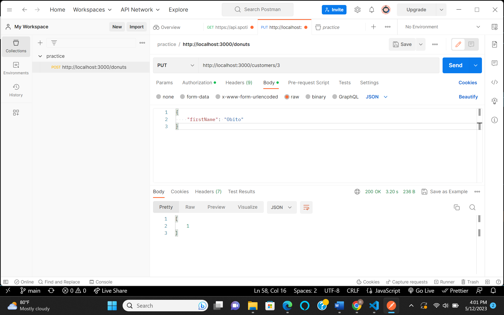
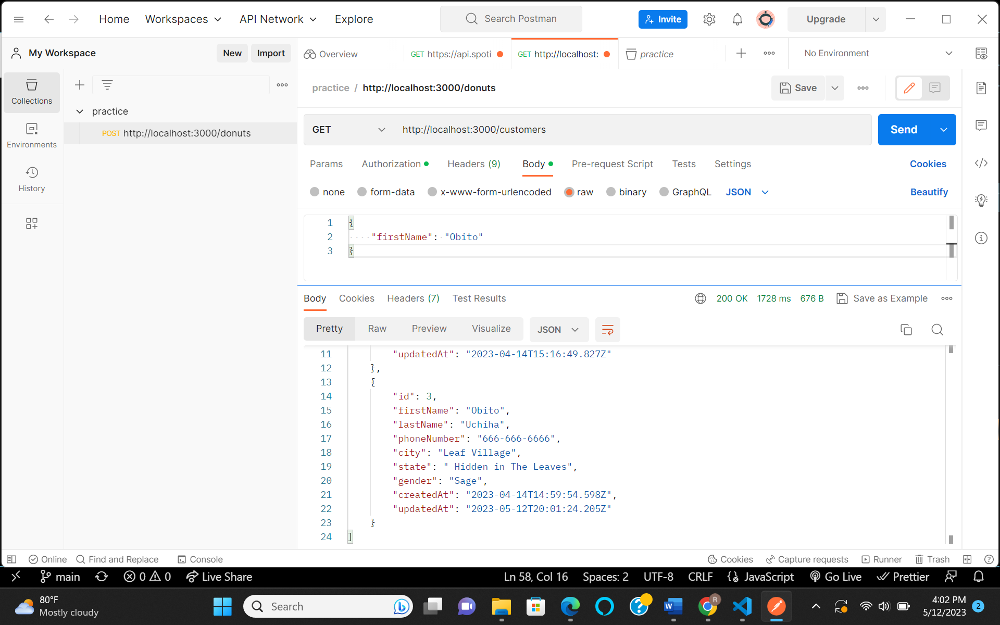
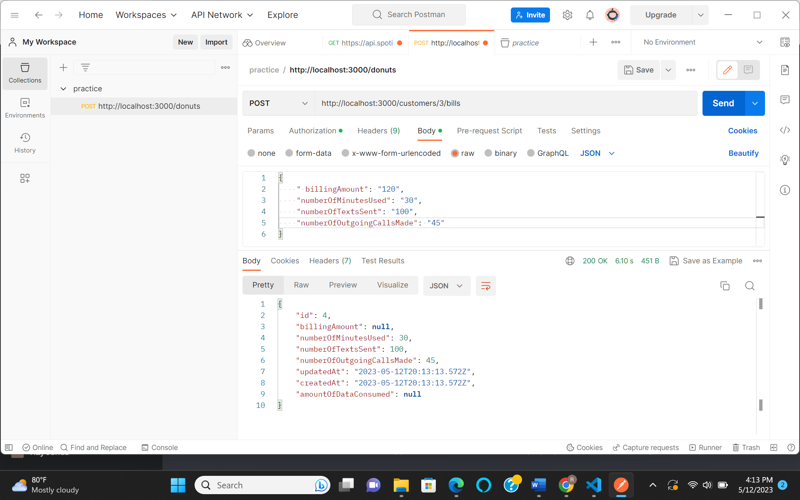
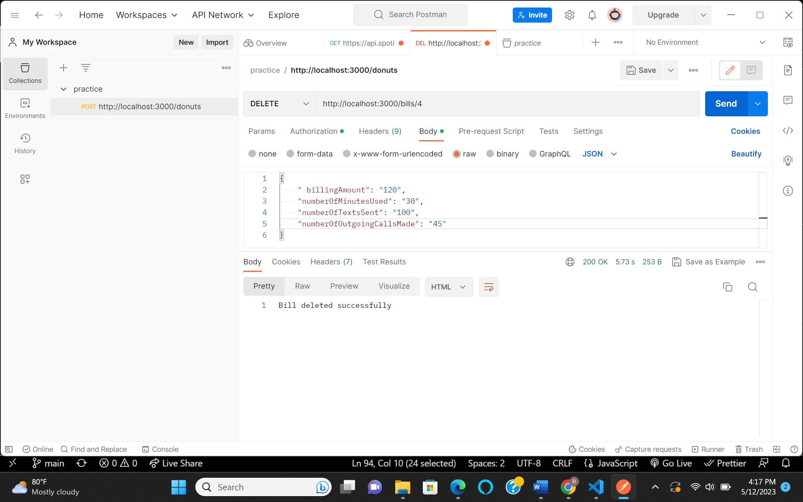

# Phone Company Application

## Prerequisites
- Node.js
- npm Node Package Manager

## Installation
1. Clone the repository:
git clone <https://github.com/Doylej16/backendProject>

2. Install dependencies:
npm install

## Usage

1. Start the application:
npm start
2. The server will start listening on port 3000.

## API Endpoints

-POST /customers: Create a new customer.
-GET /customers: Get all customers.
-PUT /customers/:id: Update a customer by ID.
-DELETE /customers/:id: Delete a customer by ID.
-POST /customers/:id/bills: Create a new bill for a customer.
-PUT /bills/:id: Update a bill by ID.
-DELETE /bills/:id: Delete a bill by ID.

## Logging

The application uses Winston for logging. Request and response details are logged to error.log and combined.log files.

## Screenshots

## License

This project is licensed under the MIT License.